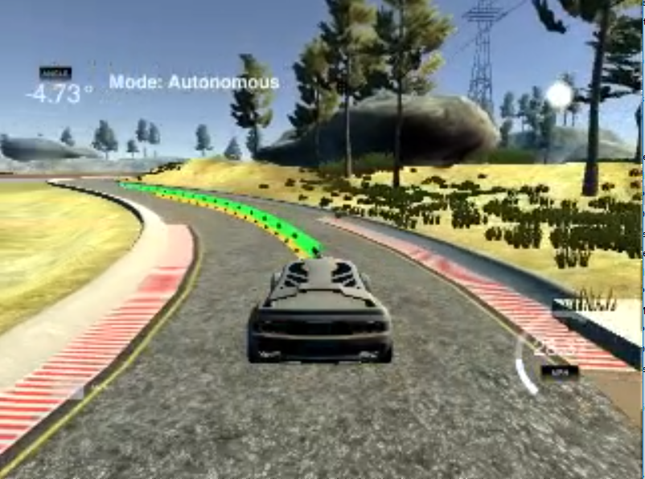

# README CarND-MPC-Project Florian Wulff

---



A video of the resulting driving around the lake in the simulator can be found in the visualization folder.

---

# CRITERIA

### Your code should compile.

`Code must compile without errors with cmake and make.`

`Given that we've made CMakeLists.txt as general as possible, it's recommend that you do not change it unless you can guarantee that your changes will still compile on any platform.`

* In the submission, there are two different main.cpp files included. If the build fails with the standard one due to uWS version issues, please try the other one. The API has changed between the versions.

## Implementation

### The Model

`Student describes their model in detail. This includes the state, actuators and update equations.`

* The model is based on the state for 
* x (position)
* y (position)
* psi (orientation)
* v (velocity)


* The state for the next timestep after dt has elapsed is defined by the following update equations:

```
x_[t+1] = x[t] + v[t] * cos(psi[t]) * dt
y_[t+1] = y[t] + v[t] * sin(psi[t]) * dt
psi_[t+1] = psi[t] + v[t] / Lf * delta[t] * dt
v_[t+1] = v[t] + a[t] * dt
```

* Lf is a factor describing the turning behavior of the car, based on the model presented in the classroom. It was obtained by measuring the radius formed by running the vehicle in the simulator around in a circle with a constant steering angle and velocity on a flat terrain. Lf was tuned until the the radius formed by the simulating the model presented in the classroom matched the previous radius.

* The error of the current position compared to the ideal behavoir is defined by the CTE (cross-track error) and epsi (orientation error). Both should be minimized using the model and optimisation to reach zero.
 
```
cte[t+1] = f(x[t]) - y[t] + v[t] * sin(epsi[t]) * dt
epsi[t+1] = psi[t] - psides[t] + v[t] * delta[t] / Lf * dt
```

* Both the reference cross track and orientation errors are 0. The reference velocity is set to 30 mph.

```
double ref_cte = 0;
double ref_epsi = 0;
double ref_v = 30;
```

* The car can be controlled using two actuators
* steering angle
* throttle (positive values indicate use of gas pedal or acceleration, negative values indicate use of brakes or braking)

The optimizer solve the model equations to minimize the cost by calculating the ideal actuations for a defined number of future timesteps as the solution.

### Timestep Length and Elapsed Duration (N & dt)

`Student discusses the reasoning behind the chosen N (timestep length) and dt (elapsed duration between timesteps) values. Additionally the student details the previous values tried.`

* N defines the number of timesteps, that will be calculated
* dt defines the duration of each timestep
* There the total duration of prediction is
* N * dt = t
* In the project, I choosed N = 20 and dt = 0.1, so t = 2 seconds
* As the uncertainty of future states increases drastically with regard to the predicted time, it is unreasonable to choose a longer duration t
* smaller values for dt will result in more frequent updates of the actuators and state and therefore usually higher accuracy and better behaviour of the car
* To achieve an equal prediction time (2s), a higher number N would be necessary to predict
* However the computational effort increases linearly with the number of predictions N, it is not reasonable to choose a very small dt
* I have choosen dt = 0.1, because the simulator has a built-in delay for applying the actuations of 100ms, which is exactly one timestep. Also more frequent actuations would not benefit the car behaviour much.

### Polynomial Fitting and MPC Preprocessing

`A polynomial is fitted to waypoints.`

If the student preprocesses waypoints, the vehicle state, and/or actuators prior to the MPC procedure it is described.

* First the waypoints coordinate system is transformed from the car coordinates system to the simulator coordinate system by shifting the reference angle by 90 degrees

* The coordinates of the waypoints are used to fit a third-degree (curve) polynomial

* The resulting coefficients (3 for a polynomial) are used to calculate the CTE and epsi for the current car position and orientation

* The 100ms latency is considered to correct for the delay

* The MPC is used to solve the optimisation problem (trajectory) and it returns the projected future states and actuation commands to reach the states

* Using the coefficients of the reference polynomial, the reference line is calculated and display in the simulator

* The predicted car coordinates for the future states are displayed as planned trajectory in the simulator

### Model Predictive Control with Latency

`The student implements Model Predictive Control that handles a 100 millisecond latency. Student provides details on how they deal with latency.`

* The simulator has built in latency of 100ms between received messages and application of the commands.
* Therefore it is necessary to either discard the first value (if dt is 0.1) or use the model equations to shift the current state into a the future by a defined value delay_t. 
* The solver then solves the equations for a future state instead of the current one. 
* This is much more flexible, in case the delay needs to be finetuned to a specific value for a real world application and therefore the preferred way.
* The can be done by using the state equations with a delay_t as dt as following:

```
// position at t + delay_t
double delay_x = v*delay_t;
double delay_y = 0;

// orientation at t + delay_t
double delay_psi = -v*steer_value / Lf * delay_t;

// velocity at t + delay_t
double delay_v = v + throttle_value*delay_t;

// predicted cte at t + delay_t
double delay_cte = cte + v*sin(epsi)*delay_t;

// predicted orientations error at t + delay_t
double delay_epsi = epsi-v*steer_value /Lf * delay_t;
```

## Simulation

### The vehicle must successfully drive a lap around the track.

`No tire may leave the drivable portion of the track surface. The car may not pop up onto ledges or roll over any surfaces that would otherwise be considered unsafe (if humans were in the vehicle).`

* Please see the included video in ./visualization/ file for demonstration of a complete lap using autonomous mode.
